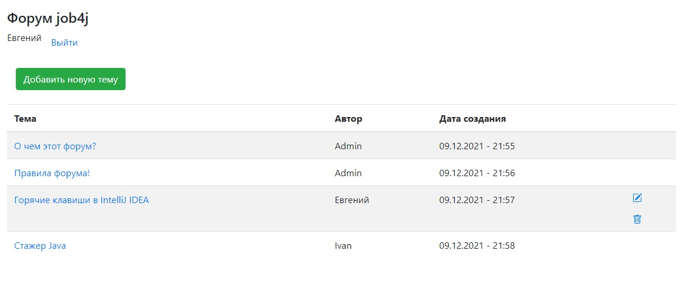
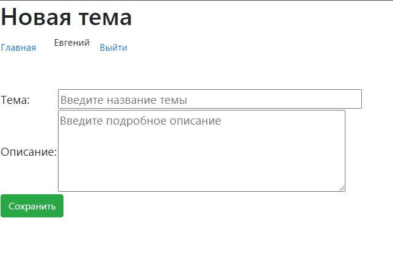
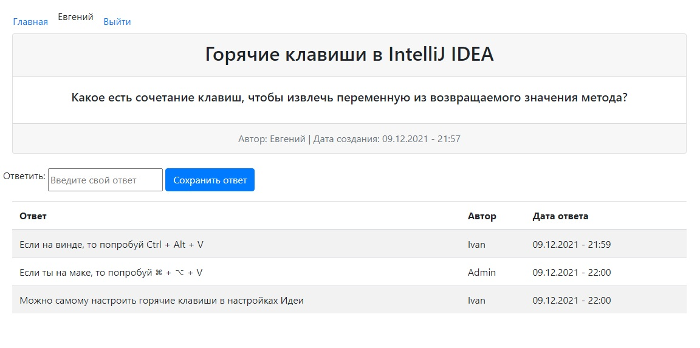
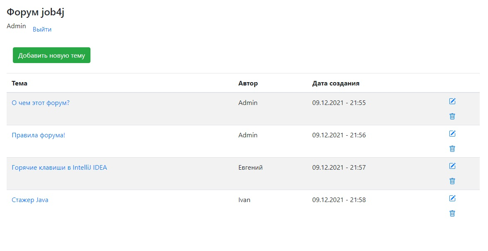
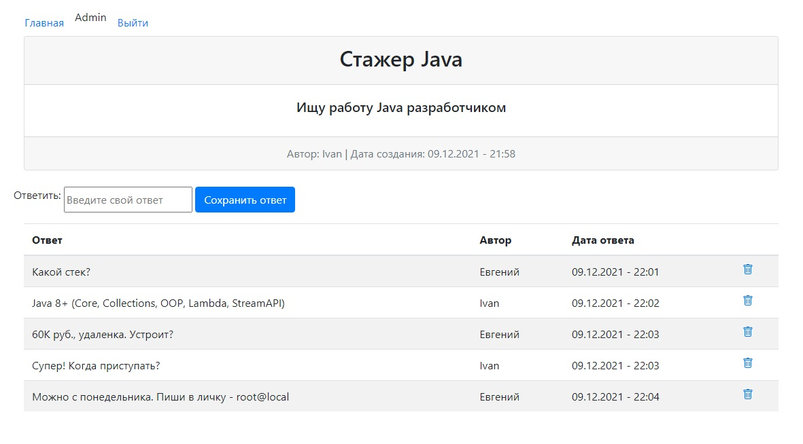

# Job4j_forum

## О проекте:

Job4j_forum - веб-приложение, классический форум на разные темы.

Использованы технологии:

- Spring Boot 2:
  - Web MVC
  - Data JPA / Hibernate
  - Security
  - Tomcat
- PostgreSQL
- Java 14
- Maven
- GitHub Actions CI

## Подробнее о приложении:

Пользователь должен пройти регистрацию и аутентификацию.

В системе у пользователей есть роли:

- **Обычные пользователи** - могут просматривать все темы, 
добавлять новые, редактировать или удалять свои и оставлять 
комментарии к любым темам.

- **Администраторы** - имеют те же права, что и обычные пользователи,
плюс могут редактировать и удалять любые темы, а также удалять
любые комментарии в любых темах (в частности из-за нарушения правил форума).

## Сборка и установка:

- `mvn inslall` - сборка в JAR - архив
  - `java -jar target/forum.jar` - запуск из командной строки / терминала
    - либо:
  - `target/forum.jar` - запуск с помощью Java(TM) Platform
  
Скрипты для базы данных: db/schema.sql

Имя базы данных: `forum`

## Контакты:
Если у вас есть какие-либо вопросы, не стесняйтесь обращаться ко мне:

Евгений Зайцев

[cyberfuzzapps@gmail.com](mailto:cyberfuzzapps@gmail.com)